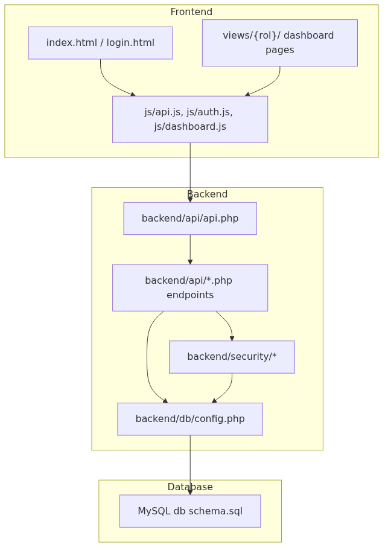
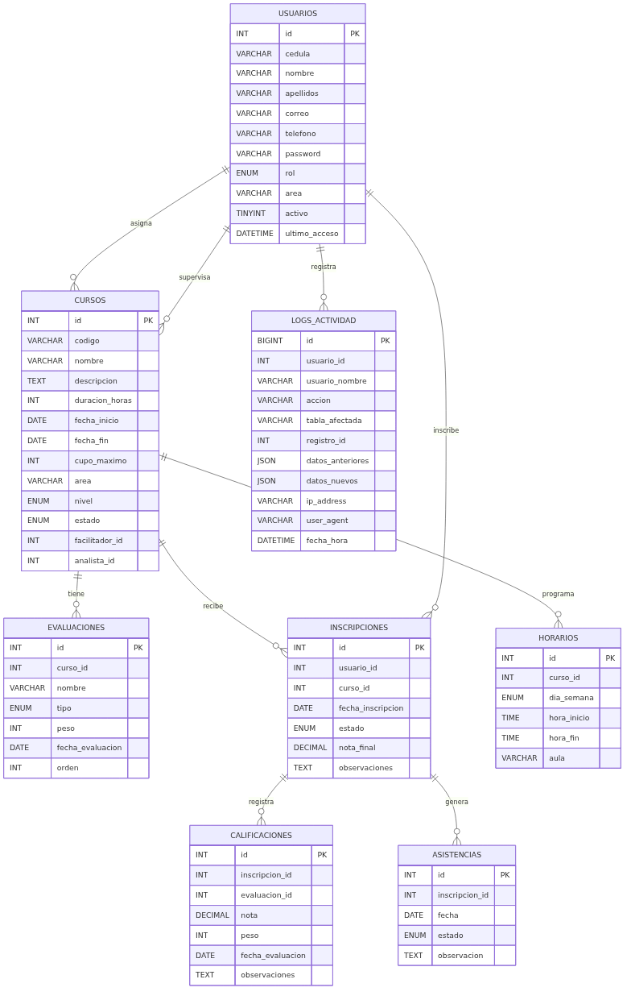
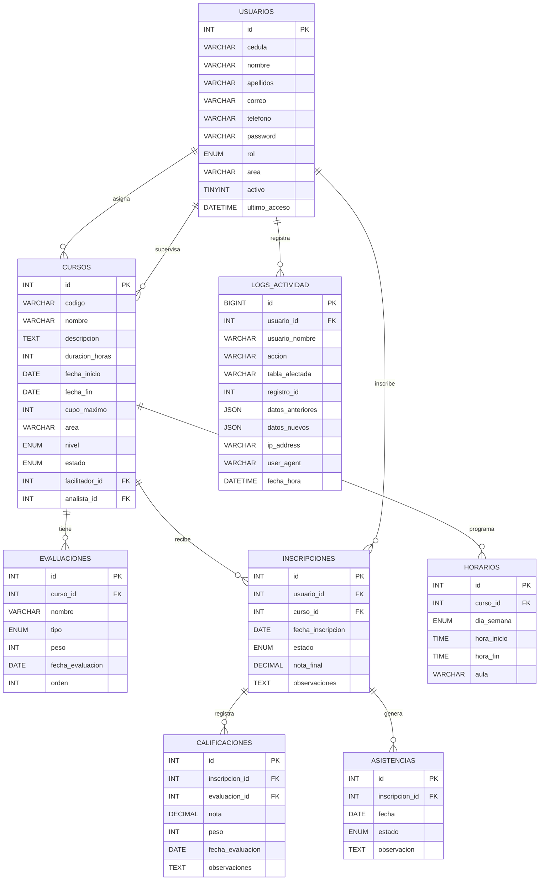
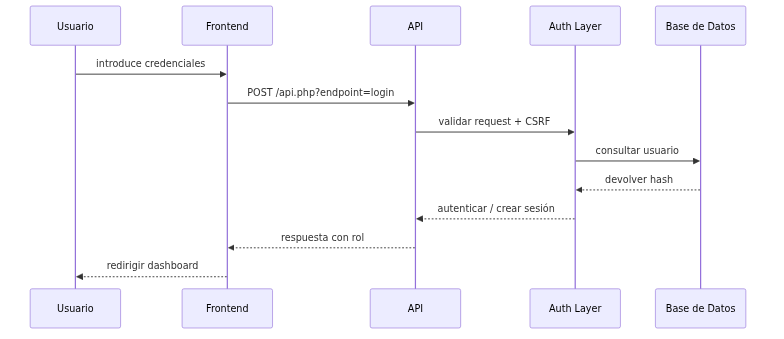
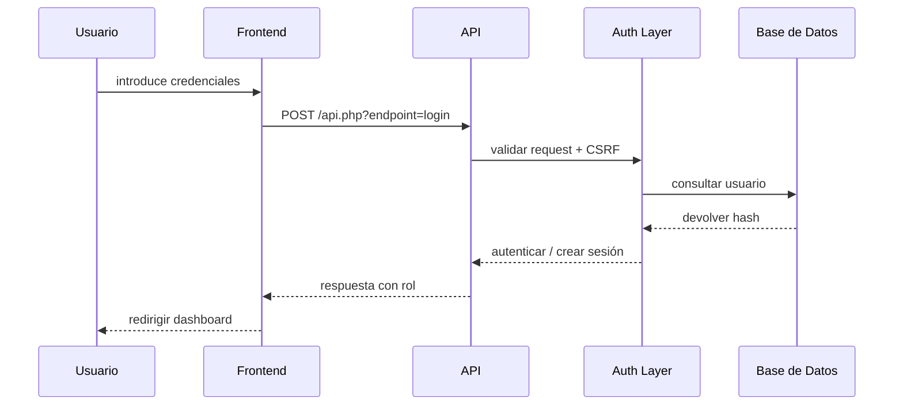
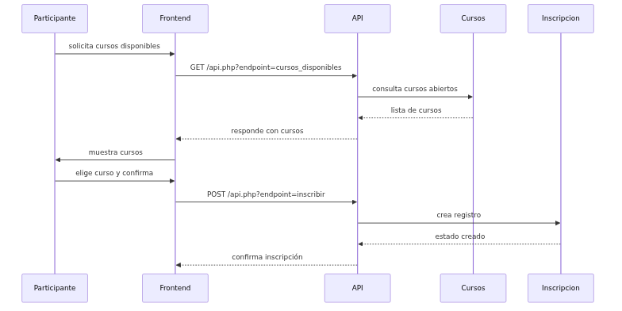
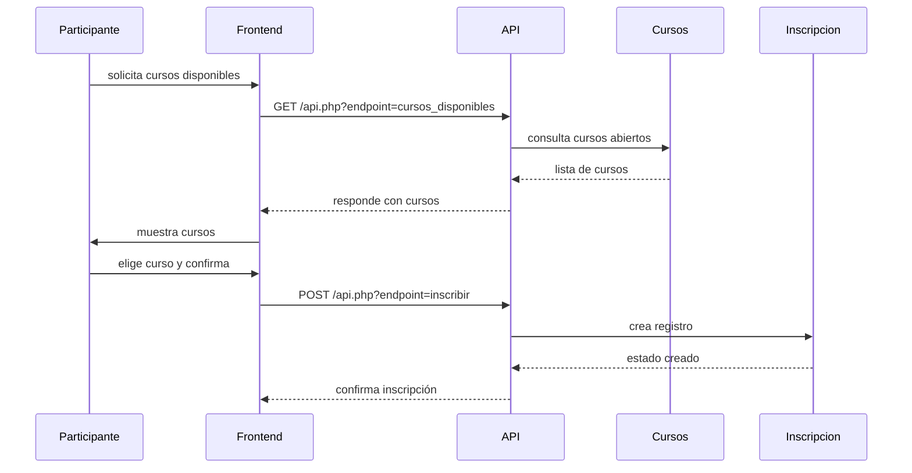

# Diagramas del Sistema

## 1. Arquitectura General

El sistema está diseñado como una aplicación web monolítica modular con separación clara entre frontend, API, lógica de negocio y acceso a datos.



```mermaid
graph TB
    subgraph Frontend
      A[index.html / login.html]
      B[views/{rol}/ dashboard pages]
      C[js/api.js, js/auth.js, js/dashboard.js]
    end

    subgraph Backend
      D[backend/api/api.php]
      E[backend/api/*.php endpoints]
      F[backend/security/*]
      G[backend/db/config.php]
    end

    subgraph Database
      H[MySQL db schema.sql]
    end

    A --> C
    B --> C
    C --> D
    D --> E
    E --> F
    E --> G
    G --> H
    F --> G
``` 

## 2. Diagrama Entidad-Relación (ER)

Este diagrama muestra las entidades principales y sus relaciones en la base de datos.





## 3. Flujo de Autenticación y Autorización





## 4. Flujo de Inscripción a Curso





## 5. Notas de Diagramas

- El backend usa middleware para `requireAuth()`, `requireAdmin()`, `validateCsrf()`.
- El frontend centraliza la comunicación con la API en `frontend/js/api.js`.
- El flujo de datos está controlado por el router en `backend/api/api.php`.
- Los logs de actividad permiten auditar operaciones críticas del sistema.
